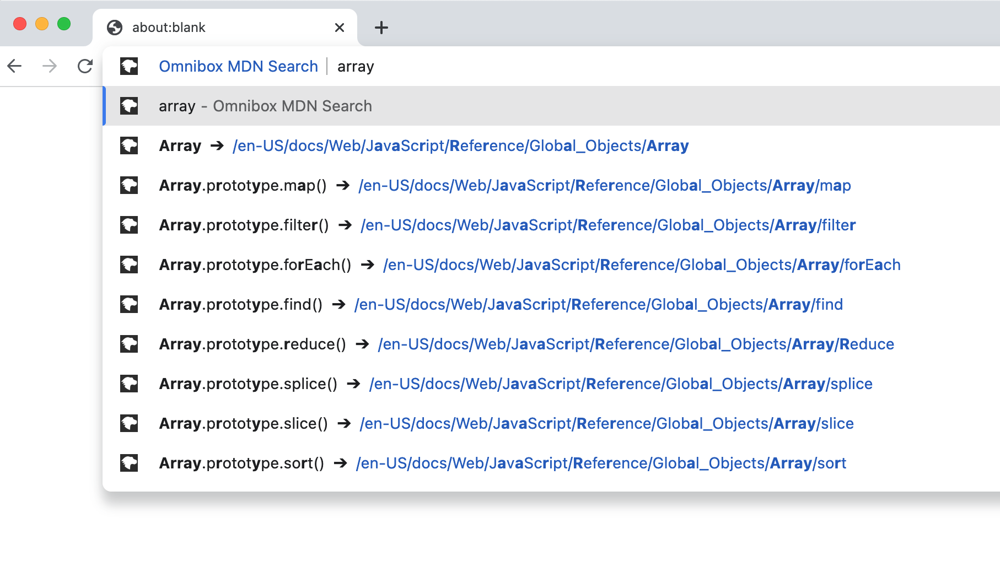

# mdn-search

a browser extension that let you use browser address bar to search MDN Web Docs with autocomplete.

# How to install
Open chrome://extensions/ , enable "Developer mode" -> click "Load unpacked" -> select this dirtory.

# How to use
On the address bar, type "mdn", then type "space" or "tab" key to active this extension. Now type keywords you want to search. This extension give you search suggestions.

# Supported browser
Chrome/Edge and Firefox